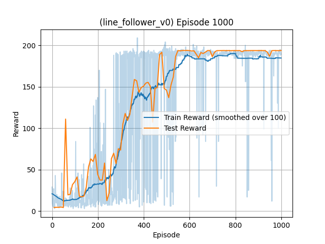

# Line Follower v0 — DQN Training

This folder contains the training, evaluation, and manual play scripts for the Line Follower v0 task. It uses the custom environment described here:

- Environment README: [../gym_envs/line_follower_v0](../gym_envs/line_follower_v0)
- Env ID: `my_gym_envs/line_follower_v0`

## Algorithm

- Deep Q-Network (DQN) with:
  - Experience Replay (uniform sampling)
  - Target Network updated every N episodes (`TARGET_UPDATE`)
  - Epsilon-greedy exploration with exponential decay
- Q-network: small MLP (state_dim -> 32 -> action_dim=3) with ReLU in between.
- Action space: Discrete(3) [turn right, go straight, turn left]
- Observation: Flattened binary sensor grid (default `(4,6)` = 24 bits)

## How Training Works

- Script: `main.py`
- Key settings (see the script for full details):
  - Episodes: `EPISODES = 500`
  - Gamma: `GAMMA = 0.9`
  - Learning rate: `LR = 1e-4`
  - Batch size: `BATCH_SIZE = 64`
  - Replay memory: `MEMORY_SIZE = 5000`
  - Target update every `TARGET_UPDATE = 10` episodes
  - Epsilon decay: `EPS_DECAY = (EPS_END/EPS_START) ** (1/(0.7*EPISODES))`
  - Env params: `sensor_grid=(4,6)`, `track="rounded_square"`, `max_steps=200`, `hitbox=40`
- Checkpointing and evaluation:
  - Saves checkpoints to `dqn_linefollower.pth`
  - Evaluates every target update via `evalualte.evaluate_model` and appends to a test curve
  - Plots smoothed training rewards and test rewards to `rewards_plot.png`

## Setup Environment

1. **Create a virtual environment** (optional but highly recommended):

   ```bash
   python -m venv venv
   source venv/bin/activate  # On Windows: venv\Scripts\activate
   ```

3. **Install PyTorch**:
   - GPU is probably not needed, and all code works fast enough on CPU, and won't be faster of GPU because simulation happens on CPU which is the biggest bottleneck. You can install PyTorch for CPU like this:

     ```bash
     pip install torch --index-url https://download.pytorch.org/whl/cpu
     ```

   - however if you absolutely want to use GPU and have a cuda supported NVIDIA Card, follow the instructions at [https://pytorch.org/get-started/locally/](https://pytorch.org/get-started/locally/).

4. **Install requirements**:

   ```bash
   pip install -r requirements.txt
   ```

5. **Install the custom environments**:

   ```bash
   cd gym_envs  # hope you had cloned with submodules properly
   pip install -e .  # install the custom gym environments
   cd ..  # go back to the root directory 😅
   ```


## How to Run

Train:

```bash
python main.py
```

Evaluate (without training):

- Requires `dqn_linefollower.pth` (already provided in this folder). You can run evaluation directly.

```bash
python evalualte.py
```

Manual Play (keyboard):

- Use `test.py` to drive the car:
  - Left/Right arrow keys to steer
  - `enable_assist = True` provides a very basic assist using edge sensors

```bash
python test.py
```

## Results

- Trained model: `dqn_linefollower.pth`
- Training and test rewards over episodes:

<p align="center">
  
</p>
